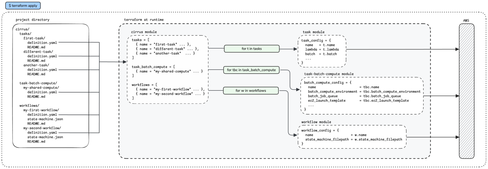

# cirrus

This module is responsible for implementing and managing a [cirrus](https://github.com/cirrus-geo/cirrus-geo)
deployment. This README covers both the module's spec and how to use it for
deploying cirrus tasks and workflows.

## Table of Contents

### Module Spec

- [Requirements](#requirements)
- [Providers](#providers)
- [Modules](#modules)
- [Inputs](#inputs)
- [Outputs](#outputs)

### Module User Guide

- [Project Setup](#project-setup)
- [Example Configuration Directory](#example-configuration-directory)
- [Cirrus Task Infrastructure vs STAC Task Code](#cirrus-task-infrastructure-vs-stac-task-code)
- [How Cirrus Terraform Configuration Works](#how-cirrus-terraform-configuration-works)
- [Template Variables in YAML Definitions and State Machine JSONs](#template-variables-in-yaml-definitions-and-state-machine-jsons)
  - [Template Variable Considerations](#template-variable-considerations)
- [Creating Cirrus Tasks](#creating-cirrus-tasks)
  - [Choosing Lambda or Batch](#choosing-lambda-or-batch)
  - [Creating a Lambda Task Definition](#creating-a-lambda-task-definition)
  - [Creating a Batch Task Definition](#creating-a-batch-task-definition)
    - [Configuring the Compute Environment](#configuring-the-compute-environment)
    - [Configuring the Batch Task](#configuring-the-batch-task)
- [Creating Cirrus Workflows](#creating-cirrus-workflows)
  - [Creating a Workflow Definition](#creating-a-workflow-definition)
  - [Defining a State Machine](#defining-a-state-machine)
    - [Basic Structure](#basic-structure)
    - [Templating Task Resource ARNs](#templating-task-resource-arns)
    - [Sample State Snippets](#sample-state-snippets)
    - [Batch Tasks in Workflows](#batch-tasks-in-workflows)
    - [Workflow Best Practices](#workflow-best-practices)

<!-- BEGIN_TF_DOCS -->
## Requirements

| Name | Version |
|------|---------|
| <a name="requirement_terraform"></a> [terraform](#requirement\_terraform) | >= 1.6.6 |
| <a name="requirement_aws"></a> [aws](#requirement\_aws) | ~> 5.22 |

## Providers

| Name | Version |
|------|---------|
| <a name="provider_aws"></a> [aws](#provider\_aws) | ~> 5.22 |

## Modules

### YAML Definition Modules

The following modules are different from a typical module in that their inputs
are stored in template YAML files that this `cirrus` module will render and
then decode into HCL before passing them as inputs to each submodule. See the
[Inputs](#inputs) section below for more information on this module's role in
the templating process.

| Name | Source | Description |
|------|--------|-------------|
| <a name="module_task_batch_compute"></a> [task_batch_compute](#module_task_batch_compute) | `./task-batch-compute` | Creates 0..many sets of Batch-related resources for cirrus batch compute |
| <a name="module_task"></a> [task](#module_task) | `./task` | Creates 0..many sets of Batch and/or Lambda resources for cirrus tasks |
| <a name="module_workflow"></a> [workflow](#module_workflow) | `./workflow` | Creates 0..many sets of AWS State Machine resources for cirrus workflows |

### Other Modules

| Name | Source | Description |
|------|--------|-------------|
| <a name="module_custom_warning_alarms"></a> [custom_warning_alarms](#module_custom_warning_alarms) | `../base_infra/alerts` |  |
| <a name="module_base"></a> [base](#module_base) | `./base` |  |
| <a name="module_builtin_functions"></a> [builtin_functions](#module_builtin_functions) | `./builtin-functions` |  |
| <a name="module_custom_critical_alarms"></a> [custom_critical_alarms](#module_custom_critical_alarms) | `../base_infra/alerts` |  |
| <a name="module_typed_definitions"></a> [typed_definitions](#module_typed_definitions) | `./typed-definitions` |  |

## Inputs

| Name | Description | Type | Default | Required |
|------|-------------|------|---------|:--------:|
| <a name="input_resource_prefix"></a> [resource\_prefix](#input\_resource\_prefix) | String prefix to be used in every named resource. | `string` | n/a | yes |
| <a name="input_project_name"></a> [project\_name](#input\_project\_name) | Project name. | `string` | n/a | yes |
| <a name="input_environment"></a> [environment](#input\_environment) | Project environment name. | `string` | n/a | yes |
| <a name="input_vpc_id"></a> [vpc\_id](#input\_vpc\_id) | VPC in which all cirrus resources will be deployed. | `string` | n/a | yes |
| <a name="input_vpc_subnet_ids"></a> [vpc\_subnet\_ids](#input\_vpc\_subnet\_ids) | List of subnet ids in the target VPC that cirrus resources should be connected to. | `list(string)` | n/a | yes |
| <a name="input_vpc_security_group_ids"></a> [vpc\_security\_group\_ids](#input\_vpc\_security\_group\_ids) | List of security groups in the target VPC that cirrus resources should use. | `list(string)` | n/a | yes |
| <a name="input_cirrus_lambda_version"></a> [cirrus\_lambda\_version](#input\_cirrus\_lambda\_version) | (Optional) Version of Cirrus lambda to deploy. Please ensure the Cirrus version you set is compatible with this module.<br/><br/>If `null`, defaults to the Cirrus version associated with this FilmDrop release.<br/><br/>See [cirrus-geo releases](https://github.com/cirrus-geo/cirrus-geo/releases) for more information. | `string` | `null` | no |
| <a name="input_cirrus_lambda_zip_filepath"></a> [cirrus\_lambda\_zip\_filepath](#input\_cirrus\_lambda\_zip\_filepath) | (Optional) Filepath to a cirrus lambda dist ZIP. The filepath is relative to the root module of this Terraform deployment. Only set if you want to test with an unreleased version of Cirrus.<br/><br/>If `null`, will download from GitHub Releases the version of Cirrus as specified in `cirrus_lambda_version`. | `string` | `null` | no |
| <a name="input_cirrus_data_bucket"></a> [cirrus\_data\_bucket](#input\_cirrus\_data\_bucket) | (Optional) S3 bucket for storing cirrus outputs. If provided, the bucket is presumed to have already been created outside of this module and that you have the necessary permissions in place to allow access for resources created by this module.<br/><br/>If `null` or `""`, the bucket will be created and tracked by this module instead. | `string` | `""` | no |
| <a name="input_cirrus_payload_bucket"></a> [cirrus\_payload\_bucket](#input\_cirrus\_payload\_bucket) | (Optional) S3 bucket for storing cirrus payloads. If provided, the bucket is presumed to have already been created outside of this module and that you have the necessary permissions in place to allow access for resources created by this module.<br/><br/>If `null` or `""`, the bucket will be created and tracked by this module instead. | `string` | `""` | no |
| <a name="input_cirrus_api_rest_type"></a> [cirrus\_api\_rest\_type](#input\_cirrus\_api\_rest\_type) | (Optional) Cirrus API Gateway type.<br/><br/>Must be one of: `EDGE`, `REGIONAL`, or `PRIVATE`. | `string` | `"EDGE"` | no |
| <a name="input_cirrus_private_api_additional_security_group_ids"></a> [cirrus\_private\_api\_additional\_security\_group\_ids](#input\_cirrus\_private\_api\_additional\_security\_group\_ids) | (Optional) List of security group IDs that'll be applied to the VPC interface endpoints of a PRIVATE-type cirrus API Gateway.<br/><br/>These security groups are in addition to the security groups that allow traffic from the `var.vpc_subnet_ids` CIDR ranges.<br/><br/>Only applicable when `var.cirrus_api_rest_type` is `PRIVATE`. | `list(string)` | `null` | no |
| <a name="input_cirrus_log_level"></a> [cirrus\_log\_level](#input\_cirrus\_log\_level) | (Optional) Cirrus log level. Passed to each of the cirrus lambda functions as the `CIRRUS_LOG_LEVEL` environment variable.<br/><br/>Must be one of: `DEBUG`, `INFO`, `WARNING`, or `ERROR`. | `string` | `"INFO"` | no |
| <a name="input_cirrus_api_lambda_timeout"></a> [cirrus\_api\_lambda\_timeout](#input\_cirrus\_api\_lambda\_timeout) | (Optional) Cirrus `api` lambda timeout (seconds). | `number` | `10` | no |
| <a name="input_cirrus_api_lambda_memory"></a> [cirrus\_api\_lambda\_memory](#input\_cirrus\_api\_lambda\_memory) | (Optional) Cirrus `api` lambda memory (MB). | `number` | `128` | no |
| <a name="input_cirrus_process_lambda_timeout"></a> [cirrus\_process\_lambda\_timeout](#input\_cirrus\_process\_lambda\_timeout) | (Optional) Cirrus `process` lambda timeout (seconds). | `number` | `10` | no |
| <a name="input_cirrus_process_lambda_memory"></a> [cirrus\_process\_lambda\_memory](#input\_cirrus\_process\_lambda\_memory) | (Optional) Cirrus `process` lambda memory (MB). | `number` | `128` | no |
| <a name="input_cirrus_process_lambda_reserved_concurrency"></a> [cirrus\_process\_lambda\_reserved\_concurrency](#input\_cirrus\_process\_lambda\_reserved\_concurrency) | (Optional) Cirrus `process` lambda reserved concurrent executions. See [lambda concurrency AWS documentation](https://docs.aws.amazon.com/lambda/latest/dg/lambda-concurrency.html). | `number` | `16` | no |
| <a name="input_cirrus_process_sqs_timeout"></a> [cirrus\_process\_sqs\_timeout](#input\_cirrus\_process\_sqs\_timeout) | (Optional) Cirrus `process` SQS queue visibility timeout (seconds). This should exceed `var.cirrus_process_lambda_timeout` to ensure messages are not re-enqueued prior to `process` lambda completion. | `number` | `180` | no |
| <a name="input_cirrus_process_sqs_max_receive_count"></a> [cirrus\_process\_sqs\_max\_receive\_count](#input\_cirrus\_process\_sqs\_max\_receive\_count) | (Optional) Cirrus `process` SQS queue max receive count. Used in the redrive policy to set a message's maximum attempts before being moved to the `process`'s dead-letter queue. | `number` | `5` | no |
| <a name="input_cirrus_update_state_lambda_timeout"></a> [cirrus\_update\_state\_lambda\_timeout](#input\_cirrus\_update\_state\_lambda\_timeout) | (Optional) Cirrus `update-state` lambda timeout (seconds). | `number` | `15` | no |
| <a name="input_cirrus_update_state_lambda_memory"></a> [cirrus\_update\_state\_lambda\_memory](#input\_cirrus\_update\_state\_lambda\_memory) | (Optional) Cirrus `update-state` lambda memory (MB). | `number` | `128` | no |
| <a name="input_cirrus_pre_batch_lambda_timeout"></a> [cirrus\_pre\_batch\_lambda\_timeout](#input\_cirrus\_pre\_batch\_lambda\_timeout) | (Optional) Cirrus `pre-batch` lambda timeout (seconds). | `number` | `15` | no |
| <a name="input_cirrus_pre_batch_lambda_memory"></a> [cirrus\_pre\_batch\_lambda\_memory](#input\_cirrus\_pre\_batch\_lambda\_memory) | (Optional) Cirrus `pre-batch` lambda memory (MB). | `number` | `128` | no |
| <a name="input_cirrus_post_batch_lambda_timeout"></a> [cirrus\_post\_batch\_lambda\_timeout](#input\_cirrus\_post\_batch\_lambda\_timeout) | (Optional) Cirrus `post-batch` lambda timeout (seconds). | `number` | `15` | no |
| <a name="input_cirrus_post_batch_lambda_memory"></a> [cirrus\_post\_batch\_lambda\_memory](#input\_cirrus\_post\_batch\_lambda\_memory) | (Optional) Cirrus `post-batch` lambda memory (MB). | `number` | `128` | no |
| <a name="input_cirrus_timestream_magnetic_store_retention_period_in_days"></a> [cirrus\_timestream\_magnetic\_store\_retention\_period\_in\_days](#input\_cirrus\_timestream\_magnetic\_store\_retention\_period\_in\_days) | (Optional) Duration for which cirrus state events must be stored in the Timestream database table's magnetic store (days). | `number` | `93` | no |
| <a name="input_cirrus_timestream_memory_store_retention_period_in_hours"></a> [cirrus\_timestream\_memory\_store\_retention\_period\_in\_hours](#input\_cirrus\_timestream\_memory\_store\_retention\_period\_in\_hours) | (Optional) Duration for which cirrus state events must be stored in the Timestream database table's memory store (hours). | `number` | `24` | no |
| <a name="input_deploy_alarms"></a> [deploy\_alarms](#input\_deploy\_alarms) | (Optional) Whether CloudWatch alarms should be deployed. | `bool` | `true` | no |
| <a name="input_warning_sns_topic_arn"></a> [warning\_sns\_topic\_arn](#input\_warning\_sns\_topic\_arn) | (Optional) SNS topic to be used by all cirrus `warning` alarms.<br/><br/>Must be set if `var.deploy_alarms` is `true`. Has no effect if `var.deploy_alarms` is `false`. | `string` | `null` | no |
| <a name="input_critical_sns_topic_arn"></a> [critical\_sns\_topic\_arn](#input\_critical\_sns\_topic\_arn) | (Optional) SNS topic to be used by all cirrus `critical` alarms.<br/><br/>Must be set if `var.deploy_alarms` is `true`. Has no effect if `var.deploy_alarms` is `false`. | `string` | `null` | no |
| <a name="input_cirrus_cli_iam_role_trust_principal"></a> [cirrus\_cli\_iam\_role\_trust\_principal](#input\_cirrus\_cli\_iam\_role\_trust\_principal) | (Optional) List of IAM principal ARNs that can assume the cirrus CLI IAM management role.<br/><br/>If `null`, the role will not be created. | `list(string)` | `null` | no |
| <a name="input_custom_cloudwatch_warning_alarms_map"></a> [custom\_cloudwatch\_warning\_alarms\_map](#input\_custom\_cloudwatch\_warning\_alarms\_map) | (Optional) Map of custom CloudWatch `warning` alarms to be created. See the [custom\_warning\_alarms](#modules) module. | `map(any)` | `{}` | no |
| <a name="input_custom_cloudwatch_critical_alarms_map"></a> [custom\_cloudwatch\_critical\_alarms\_map](#input\_custom\_cloudwatch\_critical\_alarms\_map) | (Optional) Map of custom CloudWatch `critical` alarms to be created. See the [custom\_critical\_alarms](#modules) module. | `map(any)` | `{}` | no |
| <a name="input_cirrus_task_batch_compute_definitions_dir"></a> [cirrus\_task\_batch\_compute\_definitions\_dir](#input\_cirrus\_task\_batch\_compute\_definitions\_dir) | (Optional) Filepath to a directory containing task batch compute definition subdirectories. Path is relative to this Terraform deployment's root module.<br/><br/>The specified directory's expected structure is:<pre>your-task-batch-compute-dir/<br/>  example-compute-1/<br/>    definition.yaml<br/>    README.md (optional)<br/>  example-compute-2/<br/>    definition.yaml<br/>    README.md (optional)<br/><br/>  ... more task-batch-compute subdirs ...</pre>Where each `definition.yaml` is a YAML representation of the `task-batch-compute` module's `batch_compute_config` input HCL variable. See that module's [inputs](./task-batch-compute/README.md#input\_batch\_compute\_config) for valid `batch_compute_config` object attributes.<br/><br/>This module will glob for all `definition.yaml` files that are *exactly* one subdirectory deep in the specified directory. The enclosing subdirectory's name should match the task batch compute `name`.<br/><br/>If `null`, no task batch compute resources will be created. | `string` | `null` | no |
| <a name="input_cirrus_task_batch_compute_definitions_variables"></a> [cirrus\_task\_batch\_compute\_definitions\_variables](#input\_cirrus\_task\_batch\_compute\_definitions\_variables) | (Optional) Map of maps to strings used when templating task batch compute YAML definitions prior to their conversion to HCL. Intended for abstracting any environment-specific values away from the task batch compute definition. One such example would be restricting the maximum `vCPU` size of a batch compute environment in a `dev` environment.<br/><br/>If you do not require any environment-specific values, you do not need to use this.<br/><br/>The suggested (but not required) structure of this map is to group template variables by their task batch compute `name`:<pre>{<br/>  example-compute-1 = {<br/>    max_vcpus      = 10<br/>    instance_types = ["t2.micro"]<br/>  }<br/>  example-compute-2 = {<br/>    max_vcpus = 40<br/>  }<br/><br/>  ... more task-batch-compute maps ...<br/>}</pre>Your task batch compute YAML definitions would leverage this templating by using an attribute lookup in an interpolation sequence (`${...}`) like so:<pre>name: example-compute-1<br/>batch_compute_environment:<br/>  compute_resources:<br/>    type: EC2<br/>    max_vcpus: \${example-compute-1.max_vcpus}<br/>    instance_types: \${example-compute-1.instance_types}<br/><br/>... any other config ...</pre>Each interpolation sequence's lookup value must have an associated entry in this map. If not, Terraform will raise a runtime error.<br/><br/>Since the Cirrus data and payload buckets will always be different for each environment, there are two predefined variables `CIRRUS_DATA_BUCKET` and `CIRRUS_PAYLOAD_BUCKET` that can be used to automatically reference these bucket names in your task batch compute definition YAML. You don't need to add entries to this variable for these.<br/><br/>If `null` or `{}`, templating will technically still occur but nothing will be interpolated (provided your definition is also absent of interpolation sequences). | `map(map(string))` | `{}` | no |
| <a name="input_cirrus_task_batch_compute_definitions_variables_ssm"></a> [cirrus\_task\_batch\_compute\_definitions\_variables\_ssm](#input\_cirrus\_task\_batch\_compute\_definitions\_variables\_ssm) | (Optional) Map of maps to SSM parameter paths used when templating task batch compute YAML definitions prior to their conversion to HCL. This variable works identically to `cirrus_task_batch_compute_definitions_variables` but sources values from AWS Systems Manager Parameter Store instead of static configuration.<br/><br/>Works identically to `cirrus_task_definitions_variables_ssm` but applies to task batch compute YAML definitions instead of task definitions. See that variable's documentation for detailed usage examples and best practices.<br/><br/>Example structure:<pre>{<br/>  my-compute-env = {<br/>    instance_type = "/cirrus/task-batch-compute/my-compute-env/preferred-instance-type"<br/>    max_vcpus     = "/cirrus/task-batch-compute/my-compute-env/max-vcpus-limit"<br/>  }<br/>}</pre> | `map(map(string))` | `{}` | no |
| <a name="input_cirrus_task_definitions_dir"></a> [cirrus\_task\_definitions\_dir](#input\_cirrus\_task\_definitions\_dir) | (Optional) Filepath to directory containing task definition subdirectories. Path is relative to this Terraform deployment's root module.<br/><br/>The specified directory's expected structure is:<pre>example-task-1/<br/>  definition.yaml<br/>  README.md (optional)<br/>example-task-2/<br/>  definition.yaml<br/>  README.md (optional)<br/><br/>... more task subdirs ...</pre>Where each `definition.yaml` is a YAML representation of the `task` module's `task_config` input HCL variable. See that module's [inputs](./task/README.md#input\_task\_config) for valid `task_config` object attributes.<br/><br/>If `null`, no task resources will be created. | `string` | `null` | no |
| <a name="input_cirrus_task_definitions_variables"></a> [cirrus\_task\_definitions\_variables](#input\_cirrus\_task\_definitions\_variables) | (Optional) Map of maps to strings used when templating task YAML definitions prior to their conversion to HCL. Intended for abstracting environment-specific values away from the task definition. One such example of this would be targeting different ECR image tags in a `dev` and `prod` environment.<br/><br/>The suggested (but not required) structure of this map is to group template variables by their task name:<pre>{<br/>  example-task-1 = {<br/>    image_tag = "v1.0"<br/>  }<br/>  example-task-2 = {<br/>    image_tag   = "v1.3"<br/>    data_bucket = "dev-bucket-name"<br/>  }<br/><br/>  ... more task maps ...<br/>}</pre>Your task YAML definitions would leverage this templating by using an attribute lookup in an interpolation sequence (`${...}`) like so:<pre>name: example-task-2<br/>common_role_statements:<br/>  - sid: ReadSomeBucketThatChangesForEachEnvironment<br/>    effect: Allow<br/>    actions:<br/>      - s3:ListBucket<br/>      - s3:GetObject<br/>      - s3:GetBucketLocation<br/>    resources:<br/>      - arn:aws:s3:::\${example-task-2.data_bucket}<br/>      - arn:aws:s3:::\${example-task-2.data_bucket}/*<br/>lambda:<br/>  ecr_image_uri: your-ECR-URI:\${example-task-2.image_tag}<br/><br/>... any other config ...</pre>Each interpolation sequence's lookup value must have an associated entry in this map. If not, Terraform will raise a runtime error.<br/><br/>Since the Cirrus data and payload buckets will always be different for each environment, there are two predefined variables `CIRRUS_DATA_BUCKET` and `CIRRUS_PAYLOAD_BUCKET` that can be used to automatically reference these bucket names in your task definition YAML. You don't need to add entries to this variable for these.<br/><br/>If `null` or `{}`, templating will technically still occur but nothing will be interpolated (provided your definition is also absent of interpolation sequences). | `map(map(string))` | `{}` | no |
| <a name="input_cirrus_task_definitions_variables_ssm"></a> [cirrus\_task\_definitions\_variables\_ssm](#input\_cirrus\_task\_definitions\_variables\_ssm) | (Optional) Map of maps to SSM parameter paths used when templating task YAML definitions prior to their conversion to HCL. This variable works identically to `cirrus_task_definitions_variables` but sources values from AWS Systems Manager Parameter Store instead of static configuration.<br/><br/>**Important**: the targeted SSM parameter must be a simple `String` type. Do **not** use this for passing sensitive information - that is not the intended purpose of this. Values will be stored in plaintext in the state file and visible in Terraform output.<br/><br/>This is particularly useful for values that change frequently or are managed by CI/CD pipelines, such as container image tags that are updated by application build processes. However, you should prefer static configuration over SSM parameters, if possible, for simplicity.<br/><br/>The parameter path is arbitrary. It just needs to exist in the same account as this deployment.<br/><br/>The suggested (but not required) structure of this map is to group SSM parameter mappings by their task name:<pre>{<br/>  example-task-1 = {<br/>    image_tag = "/cirrus/tasks/example-task-1/latest-image-tag"<br/>  }<br/>  example-task-2 = {<br/>    image_tag = "/cirrus/tasks/example-task-2/latest-image-tag"<br/>  }<br/><br/>  ... more task maps ...<br/>}</pre>Your task YAML definitions would leverage this templating using the same attribute lookup syntax as static variables:<pre>name: example-task-2<br/>lambda:<br/>  ecr_image_uri: your-ECR-URI:\${example-task-2.image_tag}<br/>batch:<br/>  ...<br/><br/>... any other config ...</pre>SSM parameter values are resolved at Terraform plan time, so the current parameter values will be visible in the plan output. If both `cirrus_task_definitions_variables` and this variable contain the same task/key combination, the SSM value takes precedence. Avoid using duplicate static and SSM variable keys, though, for better readability.<br/><br/>The SSM parameters must exist before running Terraform, or the plan/apply will fail. Consider bootstrapping required parameters as part of your application deployment process.<br/><br/>These parameters *could* be managed elsewhere within the same Terraform deployment that manages this `cirrus` module; however, you will need to do a targeted first-time deploy of those resources before this module will work with them.<br/><br/>If `null` or `{}`, no SSM parameters will be queried and templating will rely solely on static variables. | `map(map(string))` | `{}` | no |
| <a name="input_cirrus_workflow_definitions_dir"></a> [cirrus\_workflow\_definitions\_dir](#input\_cirrus\_workflow\_definitions\_dir) | (Optional) Filepath to directory containing workflow definition subdirectories. Path is relative to this Terraform deployment's root module.<br/><br/>The directory's expected subdirectory structure is:<pre>example-workflow-1/<br/>  definition.yaml<br/>  state-machine.json<br/>  README.md (optional)<br/>example-workflow-2/<br/>  definition.yaml<br/>  state-machine.json<br/>  README.md (optional)<br/><br/>... more workflow subdirs ...</pre>Where each `definition.yaml` is a YAML representation of the `workflow` module's `workflow_config` input HCL variable. See that module's [inputs](./workflow/README.md#input\_workflow\_config) for valid `workflow_config` object attributes and also what a `state-machine.json` should look like.<br/><br/>If `null`, no workflow resources will be created. | `string` | `null` | no |
| <a name="input_cirrus_workflow_definitions_variables"></a> [cirrus\_workflow\_definitions\_variables](#input\_cirrus\_workflow\_definitions\_variables) | (Optional) Map of maps to strings used when templating workflow YAML definitions prior to their conversion to HCL and state machine JSONs prior to state machine creation. Intended for abstracting environment-specific values away from the workflow definition and state machine JSON.<br/><br/>This is only needed if your workflow's state machine will be using AWS services/resources that are unrelated to the cirrus tasks created by this module. One such example would be a workflow that leverages the callback task functionality provided by an `arn:aws:states:::sqs:sendMessage.waitForTaskToken` state machine resource.<br/><br/>If your state machine does not invoke any non-cirrus task resources, you do not need to use this.<br/><br/>The suggested (but not required) structure of this map is to group template variables by their workflow name:<pre>{<br/>  example-workflow-1 = {<br/>    callback_queue_arn = "dev-queue-arn"<br/>    callback_queue_url = "https://..."<br/>  }<br/>  example-workflow-2 = {<br/>    non_task_resource_arn = "dev-resource-arn"<br/>  }<br/><br/>  ... more workflow maps ...<br/>}</pre>Your workflow YAML definitions would leverage this templating by using an attribute lookup in an interpolation sequence (`${...}`) like so:<pre>name: example-workflow-1<br/>common_role_statements:<br/>  - sid: AllowSendToCallbackQueue<br/>    effect: Allow<br/>    actions:<br/>      - sqs:SendMessage<br/>    resources:<br/>      - arn:aws:s3:::\${example-workflow-1.callback_queue_arn}<br/><br/>... any other config ...</pre>And a `State` within your workflow state machine JSON would look something like this:<pre>{<br/>  "Type": "Task",<br/>  "Resource": "arn:aws:states:::sqs:sendMessage.waitForTaskToken",<br/>  "Parameters": {<br/>      "QueueUrl": "\${example-workflow-1.callback_queue_url}",<br/>      "MessageBody": {<br/>          "Message": "Hello from Step Functions!",<br/>          "TaskToken.$": "$$.Task.Token"<br/>      }<br/>  },<br/>  "Next": "SOME_NEXT_STATE"<br/>}</pre>Each interpolation sequence's lookup value must have an associated entry in this map. If not, Terraform will raise a runtime error.<br/><br/>Since the Cirrus data and payload buckets will always be different for each environment, there are two predefined variables `CIRRUS_DATA_BUCKET` and `CIRRUS_PAYLOAD_BUCKET` that can be used to automatically reference these bucket names in your workflow definition YAML and state machine JSON. You don't need to add entries to this variable for these.<br/><br/>If `null` or `{}`, templating will technically still occur but nothing will be interpolated (provided your definition is also absent of interpolation sequences). | `map(map(string))` | `{}` | no |
| <a name="input_cirrus_workflow_definitions_variables_ssm"></a> [cirrus\_workflow\_definitions\_variables\_ssm](#input\_cirrus\_workflow\_definitions\_variables\_ssm) | (Optional) Map of maps to SSM parameter paths used when templating workflow YAML definitions prior to their conversion to HCL. This variable works identically to `cirrus_workflow_definitions_variables` but sources values from AWS Systems Manager Parameter Store instead of static configuration.<br/><br/>Works identically to `cirrus_task_definitions_variables_ssm` but applies to workflow YAML definitions and state machine JSONs. See that variable's documentation for detailed usage examples and best practices.<br/><br/>Example structure:<pre>{<br/>  example-workflow-1 = {<br/>    callback_queue_arn = "/cirrus/workflows/example-workflow-1/callback-queue-arn"<br/>    callback_queue_url = "/cirrus/workflows/example-workflow-1/callback-queue-url"<br/>  }<br/>  example-workflow-2 = {<br/>    external_api_endpoint = "/cirrus/shared/external-api-endpoint"<br/>  }<br/>}</pre> | `map(map(string))` | `{}` | no |
| <a name="input_cirrus_process_sqs_cross_account_sender_arns"></a> [cirrus\_process\_sqs\_cross\_account\_sender\_arns](#input\_cirrus\_process\_sqs\_cross\_account\_sender\_arns) | List of AWS principal ARNs from external accounts that should be allowed to send messages to the cirrus process SQS queue | `list(string)` | `[]` | no |
| <a name="input_domain_alias"></a> [domain\_alias](#input\_domain\_alias) | Custom domain alias for private API Gateway endpoint | `string` | `""` | no |
| <a name="input_private_certificate_arn"></a> [private\_certificate\_arn](#input\_private\_certificate\_arn) | Private Certificate ARN for custom domain alias of private API Gateway endpoint | `string` | `""` | no |

## Outputs

| Name | Description |
|------|-------------|
| <a name="output_cirrus_publish_sns_topic_arn"></a> [cirrus\_publish\_sns\_topic\_arn](#output\_cirrus\_publish\_sns\_topic\_arn) | n/a |
| <a name="output_cirrus_workflow_event_sns_topic_arn"></a> [cirrus\_workflow\_event\_sns\_topic\_arn](#output\_cirrus\_workflow\_event\_sns\_topic\_arn) | n/a |
| <a name="output_cirrus_process_sqs_queue_arn"></a> [cirrus\_process\_sqs\_queue\_arn](#output\_cirrus\_process\_sqs\_queue\_arn) | n/a |
| <a name="output_cirrus_process_sqs_queue_url"></a> [cirrus\_process\_sqs\_queue\_url](#output\_cirrus\_process\_sqs\_queue\_url) | n/a |
| <a name="output_cirrus_process_dead_letter_sqs_queue_arn"></a> [cirrus\_process\_dead\_letter\_sqs\_queue\_arn](#output\_cirrus\_process\_dead\_letter\_sqs\_queue\_arn) | n/a |
| <a name="output_cirrus_process_dead_letter_sqs_queue_url"></a> [cirrus\_process\_dead\_letter\_sqs\_queue\_url](#output\_cirrus\_process\_dead\_letter\_sqs\_queue\_url) | n/a |
| <a name="output_cirrus_update_state_dead_letter_sqs_queue_arn"></a> [cirrus\_update\_state\_dead\_letter\_sqs\_queue\_arn](#output\_cirrus\_update\_state\_dead\_letter\_sqs\_queue\_arn) | n/a |
| <a name="output_cirrus_update_state_dead_letter_sqs_queue_url"></a> [cirrus\_update\_state\_dead\_letter\_sqs\_queue\_url](#output\_cirrus\_update\_state\_dead\_letter\_sqs\_queue\_url) | n/a |
| <a name="output_cirrus_state_dynamodb_table_name"></a> [cirrus\_state\_dynamodb\_table\_name](#output\_cirrus\_state\_dynamodb\_table\_name) | n/a |
| <a name="output_cirrus_state_dynamodb_table_arn"></a> [cirrus\_state\_dynamodb\_table\_arn](#output\_cirrus\_state\_dynamodb\_table\_arn) | n/a |
| <a name="output_cirrus_state_event_timestreamwrite_database_name"></a> [cirrus\_state\_event\_timestreamwrite\_database\_name](#output\_cirrus\_state\_event\_timestreamwrite\_database\_name) | n/a |
| <a name="output_cirrus_state_event_timestreamwrite_table_name"></a> [cirrus\_state\_event\_timestreamwrite\_table\_name](#output\_cirrus\_state\_event\_timestreamwrite\_table\_name) | n/a |
| <a name="output_cirrus_state_event_timestreamwrite_table_arn"></a> [cirrus\_state\_event\_timestreamwrite\_table\_arn](#output\_cirrus\_state\_event\_timestreamwrite\_table\_arn) | n/a |
| <a name="output_cirrus_instance_role_arn"></a> [cirrus\_instance\_role\_arn](#output\_cirrus\_instance\_role\_arn) | n/a |
| <a name="output_cirrus_instance_profile_name"></a> [cirrus\_instance\_profile\_name](#output\_cirrus\_instance\_profile\_name) | n/a |
| <a name="output_cirrus_instance_profile_arn"></a> [cirrus\_instance\_profile\_arn](#output\_cirrus\_instance\_profile\_arn) | n/a |
| <a name="output_cirrus_lambda_version"></a> [cirrus\_lambda\_version](#output\_cirrus\_lambda\_version) | n/a |
| <a name="output_cirrus_data_bucket"></a> [cirrus\_data\_bucket](#output\_cirrus\_data\_bucket) | n/a |
| <a name="output_cirrus_payload_bucket"></a> [cirrus\_payload\_bucket](#output\_cirrus\_payload\_bucket) | n/a |
| <a name="output_cirrus_workflow_state_machine_arns"></a> [cirrus\_workflow\_state\_machine\_arns](#output\_cirrus\_workflow\_state\_machine\_arns) | Map of cirrus workflow names to their AWS state machine ARN. |
| <a name="output_cirrus_workflow_state_machine_role_arns"></a> [cirrus\_workflow\_state\_machine\_role\_arns](#output\_cirrus\_workflow\_state\_machine\_role\_arns) | Map of cirrus workflow names to their AWS state machine's IAM role ARN. |
| <a name="output_cirrus_task_role_arns"></a> [cirrus\_task\_role\_arns](#output\_cirrus\_task\_role\_arns) | Map of cirrus task names to their IAM role ARN. |
| <a name="output_cirrus_task_resolved_ecr_image_digests"></a> [cirrus\_task\_resolved\_ecr\_image\_digests](#output\_cirrus\_task\_resolved\_ecr\_image\_digests) | Map of cirrus task names to their resolved ECR image digests (if `resolve_ecr_tag_to_digest` was set for the task + task type). |
| <a name="output_cirrus_task_batch_compute_template_variables"></a> [cirrus\_task\_batch\_compute\_template\_variables](#output\_cirrus\_task\_batch\_compute\_template\_variables) | Map of task batch compute names to their resolved template variables (static and SSM combined).<br/>This shows the final variable values that were used during YAML templating. |
| <a name="output_cirrus_task_template_variables"></a> [cirrus\_task\_template\_variables](#output\_cirrus\_task\_template\_variables) | Map of task names to their resolved template variables (static and SSM combined).<br/>This shows the final variable values that were used during YAML templating. |
| <a name="output_cirrus_workflow_template_variables"></a> [cirrus\_workflow\_template\_variables](#output\_cirrus\_workflow\_template\_variables) | Map of workflow names to their resolved template variables (static and SSM combined).<br/>This shows the final variable values that were used during YAML templating. |
<!-- END_TF_DOCS -->


## Project Setup

If this is your first time adding `cirrus` definitions to your project, you will
need to do the following:
  1. Create a directory named `cirrus` at the root of your terraform deployment
  repository if one does not already exist.
  2. Under this new `cirrus/` directory, create three additional directories:
      - `task-batch-compute`
      - `tasks`
      - `workflows`
  3. Update the following `cirrus` input variables in whichever `*.tfvars` file
  your project is setup to use (e.g., `inputs/dev/filmdrop.tfvars` or
  `inputs/dev/cirrus.tfvars`)
      - If you are deploying `cirrus` as part of a full FilmDrop deployment
      (typical):
          ```hcl
          cirrus_inputs = {
            ...
            task_batch_compute_definitions_dir = "cirrus/task-batch-compute"
            task_definitions_dir               = "cirrus/tasks"
            workflow_definitions_dir           = "cirrus/workflows"

            # These aren't being used yet - you'll update them later as needed:
            task_batch_compute_definitions_variables = {}
            task_definitions_variables               = {}
            workflow_definitions_variables           = {}
            ...
          }
          ```
      - Or, if you are deploying this `cirrus` module directly:
          ```hcl
          ... 
          cirrus_task_batch_compute_definitions_dir = "cirrus/task-batch-compute"
          cirrus_task_definitions_dir               = "cirrus/tasks"
          cirrus_workflow_definitions_dir           = "cirrus/workflows"

          # These aren't being used yet - you'll update them later as needed:
          cirrus_task_batch_compute_definitions_variables = {}
          cirrus_task_definitions_variables               = {}
          cirrus_workflow_definitions_variables           = {}
          ... 
          ```
  4. The `cirrus` module now knows where to glob for `definition.yaml` files
  at terraform runtime. The next step is to create some definitions.

## Example Configuration Directory

An example cirrus configuration directory is provided with this module at
[cirrus-examples](./cirrus-examples/). The contents of this directory are
discussed in further detail throughout the user guide below; if you are new to
using this `cirrus` module, it is highly suggested you read this guide in its
entirely at least once.

## Cirrus Task Infrastructure vs STAC Task Code

Before continuing, it's important to note that this module configures the
**infrastructure** component for cirrus tasks and workflows. It does not build
your STAC task code into ZIP archives or Docker images for you; rather, it only
creates the AWS infrastructure and resources necessary to deploy _existing_
versions of these artifacts into your FilmDrop/Cirrus AWS environment(s).

The **code** component for each of your STAC tasks must already exist in a
different repository, and *that* repository is responsible for building and
pushing your versioned task artifacts to somewhere this repository’s deployment
IAM Role has permission to access:
  - Docker images for lambda-based or batch-based cirrus tasks should be in an
    AWS Elastic Container Registry (ECR) accessible by the deployment role.
  - ZIP files for lambda-based cirrus tasks should be in an S3 Bucket accessible
    by the deployment role.

Before continuing with this guide, you must do one of the following for each
cirrus task you’ll be deploying:
  - Either identify an existing STAC task repository that produces one of the
    artifacts listed above; or
  - create your own repository instead (see [cirrus-task-example](https://github.com/cirrus-geo/cirrus-task-example)).

Once you’ve done this, you’re ready to continue.

## How Cirrus Terraform Configuration Works

The configuration files you'll be writing are YAML representations of the
expected input HCL objects for each of following:
  - `task-batch-compute` module's `batch_compute_config` input variable
  - `task` module's `task_config` input variable
  - `workflow` module's `workflow_config` input variable

The contents of these configuration files will be covered in this guide.

During the execution of any terraform command that reads input configurations,
such as `terraform plan` or `terraform apply`, this `cirrus` module will glob
the three cirrus configuration directories (one for each of `tasks,
task-batch-compute, and workflows) to gather the YAML configuration files you’ve
created according to this guide into lists of HCL-equivalent objects. The
`cirrus` module then iterates over these lists and passes each configuration
object to the applicable submodule which will provision the appropriate set of
AWS resources needed for that particular configuration.

YAML is used to facilitate splitting configuration objects into individual files
for improved readability/maintainability since terraform does not allow reading
an arbitrary number of HCL files into a list of objects.

Diagram of how configuration files are used by the Cirrus module:


## Template Variables in YAML Definitions and State Machine JSONs

Configurations for `task-batch-compute`, `task`, and `workflow` modules may have
slight variations across deployment environments; for example, a task in a `dev`
environment will likely be writing to a different S3 bucket than the same task
in `prod`. Because of this, cirrus YAML definitions and state machine JSONs
support environment-specific template variables.

Consider the following task `definition.yaml` snippet that allows writing to a
specific bucket:
```yaml
# ...
common_role_statements:
  - sid: AllowWriteDataBucket
    effect: Allow
    actions:
      - s3:PutObject
    resources:
      - arn:aws:s3:::my-dev-bucket/*  # hardcoded - bad
# ...
```

If you want to make the target bucket environment-specific, you should replace
the bucket name with a terraform interpolation sequence (`${...}`) instead:
```yaml
# ...
common_role_statements:
  - sid: AllowWriteDataBucket
    effect: Allow
    actions:
      - s3:PutObject
    resources:
      - arn:aws:s3:::${my-task.data_bucket}/*  # templated - good
# ...
```

Given the example above, you now need to configure what terraform should replace
`${my-task.data_bucket}` with. This is configured in the input variable file
specific to each environment, e.g., `inputs/dev/filmdrop.tfvars`,
`inputs/prod/filmdrop.tfvars`, etc.  You will need to open each of those input
variable files, find the `task_definitions_variables` map, and add an entry for
your template variable(s).

For example, an `inputs/dev/filmdrop.tfvars` file would look something like:
```hcl
cirrus_inputs = {
  task_definitions_variables = {
    my-task = {
      data_bucket = "my-dev-bucket"
    }
    ...
  }
  ...
}
```

And the `inputs/prod/filmdrop.tfvars` file would look something like:
```hcl
cirrus_inputs = {
  task_definitions_variables = {
    my-task = {
      data_bucket = "my-prod-bucket"
    }
    ...
  }
  ...
}
```

And so on for each environment.

The same pattern applies for `task-batch-compute` definitions; for each
interpolation sequence in your definition YAML, you will add an appropriate
entry in `task_batch_compute_definitions_variables` for each
environment-specific input variable file.

The same pattern applies for `workflow` definitions **and** state machine JSONs;
for each interpolation sequence in your definition YAML or state machine JSON,
you will add an appropriate entry in `workflow_definitions_variables` for each
environment-specific input variable file.

### Template Variable Considerations
  - Since the cirrus data and payload buckets will always be different for each
    environment, there are two predefined variables `CIRRUS_DATA_BUCKET` and
    `CIRRUS_PAYLOAD_BUCKET` that can be used to automatically reference these
    bucket names. You don't need to add entries in `filmdrop.tfvars` for these.
  - Common candidates for environment-specific values are data buckets, image
    tags, environment variable values, etc., but you don't need to replace them
    with template variables if their values are the same across environments.
  - Name your variables with `${your-task-name.your_variable_name}`,
    `${your-workflow-name.your_variable_name}`, etc. format. This keeps
    variables namespaced by their respective task/task-batch-compute/workflow in
    the input variable file which helps avoid configuration errors.
  - The templated value should be a primitive type (string, number, bool). Avoid
    complex or nested types as they can easily cause issues during templating.

## Creating Cirrus Tasks

Tasks in cirrus implement a unit of processing to be composed together into a
Workflow. Tasks are expected to support both input and output formatted as a
[Cirrus Process Payload](https://cirrus-geo.github.io/cirrus-geo/stable/cirrus/30_payload.html).
As part of its processing, a task can make any requisite modifications to its
input payload and/or derive any output assets, pushing them to the canonical
storage location in S3.

In other other words, to implement custom processing routines for a pipeline,
use a task. The best tasks are modular, simple, focused, and composable.

### Choosing Lambda or Batch

Each cirrus task may be configured to run as a lambda function, batch job, or
both. Consider the following when determining the appropriate one for your task:
  - Lambda:
    - **Pros**: easier to configure, easier to manage, shorter startup times,
      and generally cheaper.
    - **Cons**: limited run duration, limited vCPU, limited memory, limited
      storage (without resorting to EFS, which the cirrus module does not
      currently support), and more. Full set of limitations
      [here](https://docs.aws.amazon.com/lambda/latest/dg/gettingstarted-limits.html).
    - **Format**: requires your STAC task to be packaged as a lambda-compatible
      [ZIP archive](https://docs.aws.amazon.com/lambda/latest/dg/configuration-function-zip.html)
      or [Docker image](https://docs.aws.amazon.com/lambda/latest/dg/images-create.html).
    - **Suitable for**: simple utility tasks or operations that are guaranteed
      to always complete within the lambda limits.
  - Batch:
    - **Pros**: unbounded run duration with a wide range of vCPU, GPU, memory,
      and storage options.
    - **Cons**: increased configuration complexity, increased operational
      overhead, potentially longer task startup times, and generally more
      expensive (can be mitigated).
    - **Format**: requires your STAC task to be packaged as a Docker image that
      implements the stac-task CLI interface as the container entrypoint.
    - **Suitable for**: operations with consistently high resource requirements.
  - Both:
    - **Pros**: flexibility of choosing the type that better suits a given
      cirrus payload’s requirements.
    - **Cons**: requires near-duplicate workflows for each task type and robust
      client-side method(s) for reliably determining the appropriate task type
      _prior_ to cirrus payload submission.
    - **Format**: requires your STAC task to either be packaged as a ZIP archive
      and Docker image or just an image with an entrypoint that supports
      conditionally running in either a lambda or “normal” setting.
    - **Suitable for**: _potentially_ better for operations with varying
      resource requirements that tend to be low enough to run as a lambda
      function.

Generally speaking, each task should commit to using either lambda or batch;
only use both if you’re confident the measured benefit outweighs the increased
operational overhead.

Regardless of which type you choose, it can always be changed later.

### Creating a Lambda Task Definition

1. Determine a name for your task.
    - Use lowercase alphanumerics and hypens.
    - As a best practice, do not use `lambda`, `cirrus`, `stac`, or `task` in
      the name **unless** they mean something other than "this is a lambda
      cirrus STAC task".
2. Create a new directory at `cirrus/tasks/<your-task-name>`
3. Create a `README.md` in your task directory.
    - See [cirrus-examples/tasks/first-task-example/README.md](./cirrus-examples/tasks/first-task-example/README.md)
      for example content, though this can contain whatever you'd like; it is
      not used by this module.
4. Create a `definition.yaml` in your task directory.
    - See the [task module's task_config input](./task/README.md#input_task_config) for a
      description and list of the available `task` definition arguments.
      Remember that you will be writing the YAML equivalent of this HCL schema.
    - See [cirrus-examples/tasks/first-task-example/definition.yaml](./cirrus-examples/tasks/first-task-example/definition.yaml)
      for example YAML content.
    - If you add any template variables, you must update the
      `task_definitions_variables` map for each environment-specific input
      variable file. See [Template Variables in YAML Definitions and State Machine JSONs](#template-variables-in-yaml-definitions-and-state-machine-jsons)
      above for more information.

### Creating a Batch Task Definition

#### Configuring the Compute Environment

1. Determine the batch compute resources that your task's batch jobs will use.
   If reusing an existing one, just note the name and skip to the next section.
2. Determine a name for your batch compute resources.
    - Use lowercase alphanumerics and hypens.
    - As a best practice, do not use `cirrus`, `stac`, or `task` in the name
      **unless** they mean something other than "this is compute for a cirrus
      STAC task".
3. Create a new directory at `cirrus/task-batch-compute/<your-compute-name>`
4. Create a `README.md` in your task-batch-compute directory.
    - See [cirrus-examples/tasks-batch-compute/first-compute-example/README.md](./cirrus-examples/task-batch-compute/first-compute-example/README.md)
      for example content, though this can contain whatever you'd like; it is
      not used by this module.
5. Create a `definition.yaml` in your task-batch-compute directory.
    - See the [task-batch-compute module's batch_compute_config input](./task-batch-compute/README.md#input_batch_compute_config)
      for a description and list of the available `task-batch-compute`
      definition arguments. Remember that you will be writing the YAML
      equivalent of this HCL schema.
    - See [cirrus-examples/task-batch-compute/first-compute-example/definition.yaml](./cirrus-examples/task-batch-compute/first-compute-example/definition.yaml)
      for example YAML content.
    - If you add any template variables, you must update the
      `task_batch_compute_definitions_variables` map for each
      environment-specific input variable file. See [Template Variables in YAML Definitions and State Machine JSONs](#template-variables-in-yaml-definitions-and-state-machine-jsons)
      above for more information.

#### Configuring the Batch Task

1. Determine a name for your task.
    - Use lowercase alphanumerics and hypens.
    - As a best practice, do not use `batch`, `cirrus`, `stac`, or `task` in the
      name **unless** they mean something other than "this is a batch cirrus
      STAC task".
2. Create a new directory at `cirrus/tasks/<your-task-name>`
3. Create a `README.md` in your task directory.
    - See [cirrus-examples/tasks/first-task-example/README.md](./cirrus-examples/tasks/first-task-example/README.md)
      for example content, though this can contain whatever you'd like; it is
      not used by this module.
4. Create a `definition.yaml` in your task directory.
    - See the [task module's task_config input](./task/README.md#input_task_config) for a
      description and list of the available `task` definition arguments.
      Remember that you will be writing the YAML equivalent of this HCL schema.
    - See [cirrus-examples/tasks/first-task-example/definition.yaml](./cirrus-examples/tasks/first-task-example/definition.yaml)
      for example YAML content.
    - If you add any template variables, you must update the
      `task_definitions_variables` map for each environment-specific input
      variable file. See [Template Variables in YAML Definitions and State Machine JSONs](#template-variables-in-yaml-definitions-and-state-machine-jsons)
      above for more information.

## Creating Cirrus Workflows

Cirrus workflows are pipelines of one or more cirrus tasks run via AWS State
Machines. An AWS state machine is defined by a JSON file that uses the
[AWS States Language](https://states-language.net/).

### Creating a Workflow Definition

1. Determine a name for your workflow.
    - Use lowercase alphanumerics and hypens.
    - As a best practice, do not use `workflow`, `cirrus`, `stac`, or `task` in
      the name **unless** they mean something other than "this is a workflow for
      cirrus STAC tasks".
2. Create a new directory at `cirrus/workflows/<your-workflow-name>`
3. Create a `README.md` in your workflow directory.
    - See [cirrus-examples/workflows/first-workflow-example/README.md](./cirrus-examples/workflows/first-workflow-example/README.md)
      for example content, though this can contain whatever you'd like; it is
      not used by this module.
4. Create a `definition.yaml` in your workflow directory.
    - See the [workflow module's workflow_config input](./workflow/README.md#input_workflow_config) for a
      description and list of the available `workflow` definition arguments.
      Remember that you will be writing the YAML equivalent of this HCL schema.
    - See [cirrus-examples/workflows/example/definition.yaml](./cirrus-examples/workflows/first-workflow-example/definition.yaml)
      for example YAML content.
    - If you add any template variables, you must update the
      `workflow_definitions_variables` map for each environment-specific input
      variable file. See [Template Variables in YAML Definitions and State Machine JSONs](#template-variables-in-yaml-definitions-and-state-machine-jsons)
      above for more information.
5. Create a `state-machine.json` in your workflow directory.
    - See [Defining a State Machine](#defining-a-state-machine) to get started.
    - See [cirrus-examples/workflows/example/state-machine.json](./cirrus-examples/workflows/first-workflow-example/state-machine.json)
      for example content.
    - If you add any template variables, you must update the
      `workflow_definitions_variables` map for each environment-specific input
      variable file. See [Template Variables in YAML Definitions and State Machine JSONs](#template-variables-in-yaml-definitions-and-state-machine-jsons)
      above for more information.

### Defining a State Machine

#### Basic Structure

All workflows share some common structure within the state machine definition:
  - A `Comment` provides a short description of the workflow
  - At least one task `State` defined
  - `StartAt` set to the first state in the state machine
  - At least one state with `End: True` representing a successful completion of
    the workflow
  - A `State` of type `Fail` to which all workflow states will go on fatal error
      - Doing so necessitates that each state properly catches all errors and
        defines the `Fail` state as the next step in the event of an error (with
        some exceptions, like batch tasks, which are part of a larger block of
        connected tasks - see [Batch Tasks in Workflows](#batch-tasks-in-workflows))

#### Templating Task Resource ARNs

Each state in your workflow's state machine will typically reference a cirrus
task's associated AWS resource ARN, such as a lambda function, batch job queue,
or batch job definition. Since these AWS resources are managed by terraform,
their ARNs are not immediately available to you without deploying them first and
then hardcoding their values into the state machine JSON. This is not ideal.

Instead, template variables are used in place of hardcoded ARNs. These template
variables are interpolation sequences that will always have the following form:
```
${tasks.TASK-NAME.TASK-TYPE.TASK-ATTR}
```

Where:
```
tasks     : static namespace for cirrus task outputs
TASK-NAME : name of the cirrus task
TASK-TYPE : one of [lambda, batch]
TASK-ATTR : one of [function_arn, job_definition_arn, job_queue_arn]
```

For example:
```
${tasks.my-example-task.lambda.function_arn}
${tasks.my-other-task.batch.job_queue_arn}
${tasks.my-other-task.batch.job_definition}
```

Unlike the normal user-provided template variables defined in
`workflow_definitions_variables`, you do **not** need to provide the values
these template variables get interpolated into. The `workflow` terraform module
will use these variables as a lookup into a task's output resources and replace
each variable with the proper resource's ARN at terraform runtime.

#### Sample State Snippets

State machine definitions often contain some level of boilerplate, especially
for `State` objects. As such, some example snippets for cirrus task states are
provided:
  - [Cirrus lambda task state snippet](./cirrus-examples/workflows/first-workflow-example/state-machine-lambda-state-snippet.txt)
  - [Cirrus batch task state snippet](./cirrus-examples/workflows/first-workflow-example/state-machine-batch-state-snippet.txt)

Whenever you need to create a `State` object in your state machine JSON, you can
use these snippets by doing the following:
  1. Copy/paste the lambda or batch snippet into your JSON config.
  2. Indent appropriately.
  3. Replace instances of `TASK-NAME-PLACEHOLDER` with a valid cirrus task name.
  4. Choose if the state is terminal by keeping `Next` or `End`; if `Next`, you
     will need to replace `NEXT-STATE-PLACEHOLDER` with the next state's name.
  5. **Update the `Retry` and `Catch` blocks to something suitable for your**
     **target cirrus task.** This is especially important as error handling
     needs will vary.
  6. Modify remaining configuration as necessary.

#### Batch Tasks in Workflows

Batch task states are more complex than lambda task states. The reasoning behind
this is explained [here in the cirrus-geo documentation](https://cirrus-geo.github.io/cirrus-geo/stable/cirrus/components/workflows/batch.html).

Ignore the `Minimal example` on that page; see one or both of the following for
updated examples:
  - [Example workflow state machine](./cirrus-examples/workflows/first-workflow-example/state-machine.json)
  - [Cirrus batch task state snippet](./cirrus-examples/workflows/first-workflow-example/state-machine-batch-state-snippet.txt)

Note the usage of `pre-batch` and `post-batch` lambdas that wrap each batch task
state; **these two lambdas are automatically created for you**. You will need to
reference their task outputs in the state machine JSON but do not need to define
the tasks themselves.

#### Workflow Best Practices

See [this section downward in the cirrus-geo documentation](https://cirrus-geo.github.io/cirrus-geo/stable/cirrus/components/workflows/definitions.html#workflow-best-practices).
