## Running unit tests in a local environment

In order to run unit tests on the [application repository](https://github.com/Element84/filmdrop-ui/), do:

`npm install`

followed by

`npm test` or `npm run test` or `npm run coverage`

`npm install` will first install all modules listed as dependencies in the `package.json` file. This will install the dependencies to the local `node_modules` folder, including the `vite` and `vitest` dependencies which are used to actually run the unit tests.

`npm test` or `npm run test` will run all tests in this repository using Vitest, a Vite-native testing framework. The unit test files are mainly located within the `src/components` and `src/utils` folders. Most of the UI components, such as the Search button, Collection dropdown, and Layer Legend, each have their own unit tests. As the tests run, you will see output in the console with a list of all of the test files and counts of tests within each file, and an aggregate count of the total number of tests and test files.

You can also run `npm run coverage` to run unit tests *and* produce a coverage report for each test file.

The minimum `npm` version to run the unit tests is `version 8` and the minimum node version is `18`, as given in the `package.json` file.

The `config.json` file does NOT need to be modified in any way to run the unit tests. The tests are completely independent of this file and rely on mocking the application configuration, click results, search results, and collections list. The configuration used for mocking is provided within `src/testing/shared-mocks.js`.

## Steps to manually test live versions of the UI

There are several manual tests that can be performed on the FilmDrop Console UI once deployed to verify that the deployment passes the key unit tests. The below is a non-exhaustive list of manual tests that can be performed. It is important to note that each FilmDrop Console UI deployment is tied to a particular config file that contains the configuration for the UI. Depending on the config file, each deployment's associated set of manual tests can be different, because each unique config file deploys the FilmDrop Console UI with varying configurations.

1. As the FilmDrop Console UI loads, ensure that the text *"Loading FilmDrop UI”* appears before the underlying map loads and disappears once the map is finished loading.

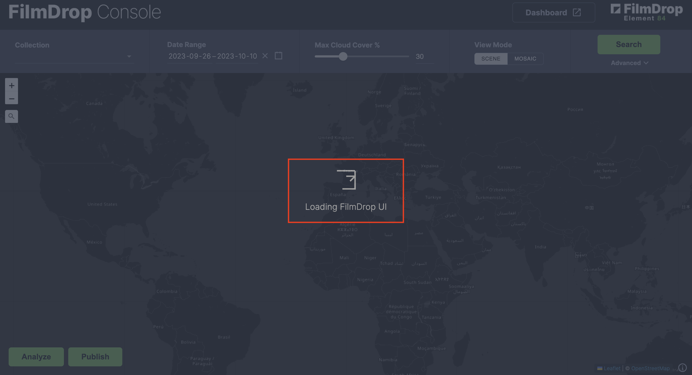

2. The 'Collection' drop-down list in the upper-left should pre-populate with the list of collections within the associated STAC API deployment. The *STAC_API_URL* variable within the config file should point to the URL of the STAC API containing the STAC items and collections that will be displayed on the console UI, and the collection drop-down should scrape the STAC_API_URL to populate the list. The default collection should be selected to be the same as the DEFAULT_COLLECTION from the config file (an optional property).

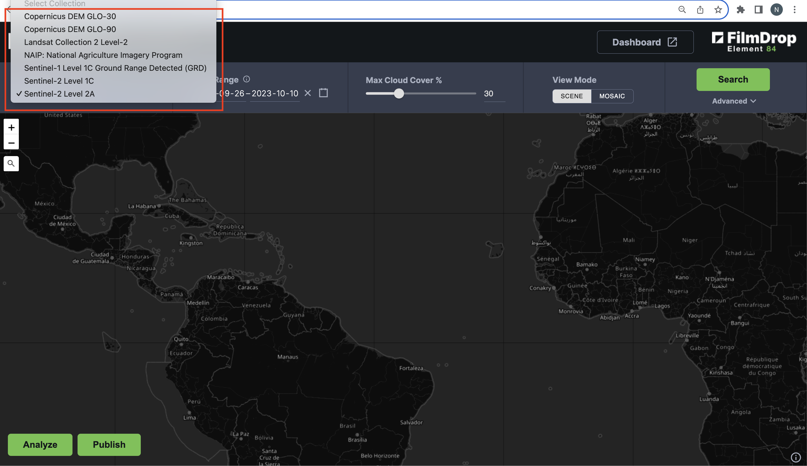

The collections in the above image are loading from the EarthSearch STAC API. This can be verified by going to [EarthSearch](https://earth-search.aws.element84.com/v1/collections) and checking to see that the collections in the drop-down match those at the collections endpoint.

The default collection here is *Sentinel-2 Level 2A*, as indicated by the check mark.

3. The date range should automatically initialize to the previous 2 weeks, whereas hovering above the 'info' (i) button next to 'Date Range' should should tell you the date range for the selected collection queried from STAC API when the console is initialized. This can be verified by navigating to the collection endpoint and checking the temporal extent.

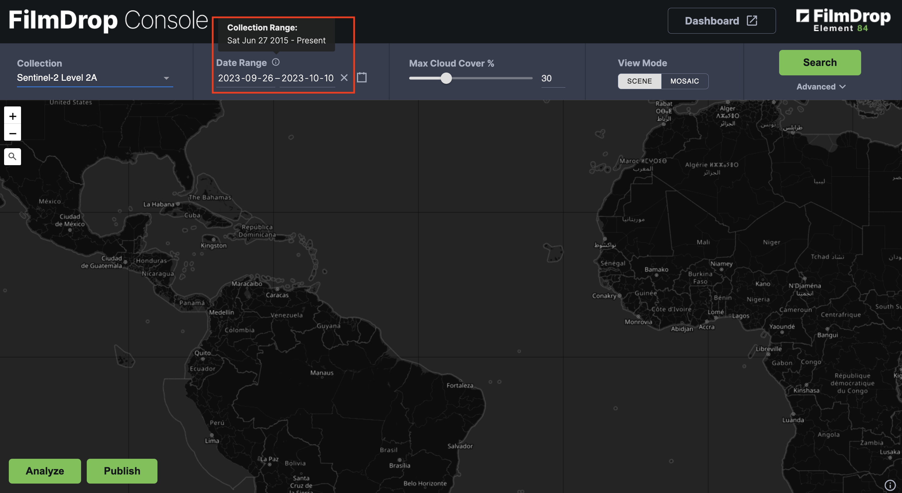

As can be seen above, the temporal range for Sentinel-2 Level 2A is *June 27, 2015 - Present*. This can be confirmed by going to the [Sentinel 2 L2A collection](https://earth-search.aws.element84.com/v1/collections/sentinel-2-l2a) and checking its temporal extent under the *extent-temporal-interval* keys.

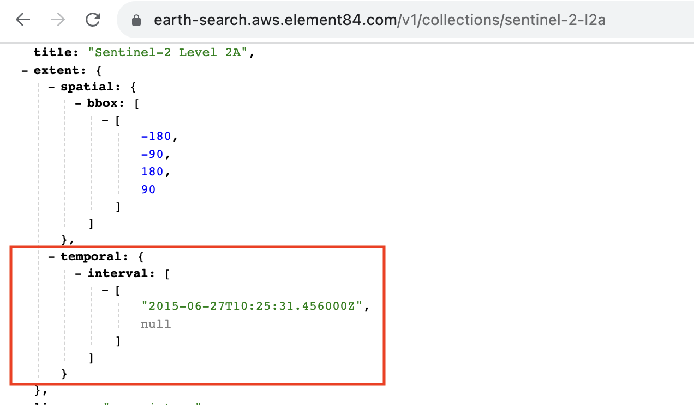

4. If you change the collection name, the date range when hovering over the 'info' button should automatically update to that collection's date range.
If the selected date range does not fall within the date range for a particular collection, that range will update to the date range for that collection. The date range for a collection is derived from a lookup of the temporal information contained within the STAC collection, usually within the *extent* field.

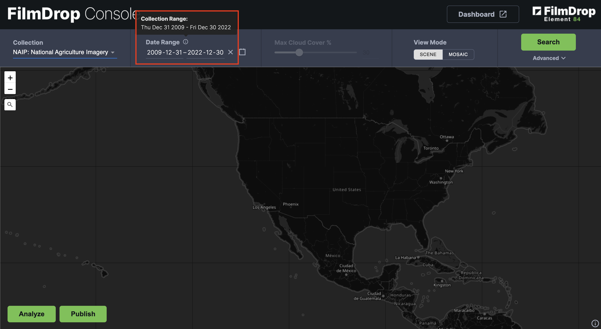

Changing the collection to *NAIP*, as seen above, changes, the date range on the info popup to *Dec 31, 2009 - Dec 30, 2022*.

5. The 'Max Cloud Cover %" slider gets automatically enabled or disabled depending on whether the selected collection's items have a cloud cover property. Cloud cover information is provided for items in a collection through the *eo:cloud_cover* property, part of the Electro-Optical extension to STAC.

The cloud cover slider is toggled off for the NAIP collection, which doesn't have an *eo:cloud_cover* property on its items.

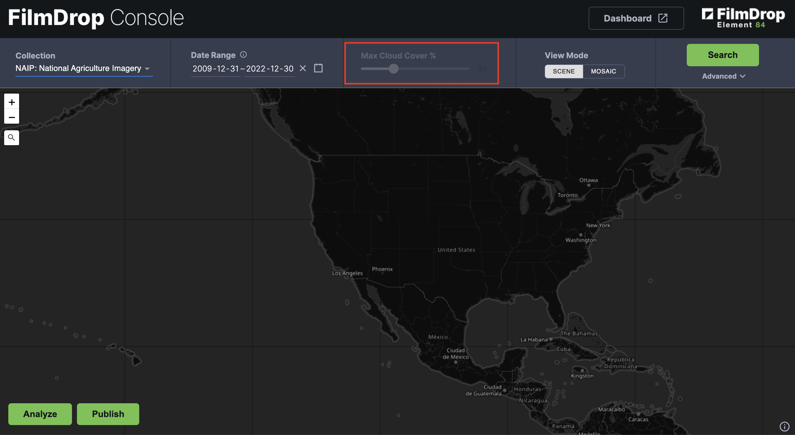

The cloud cover slider gets toggled on automatically after switching to the Sentinel-2 Level 1C collection, which has an *eo:cloud_cover* property on its items, as shown below.

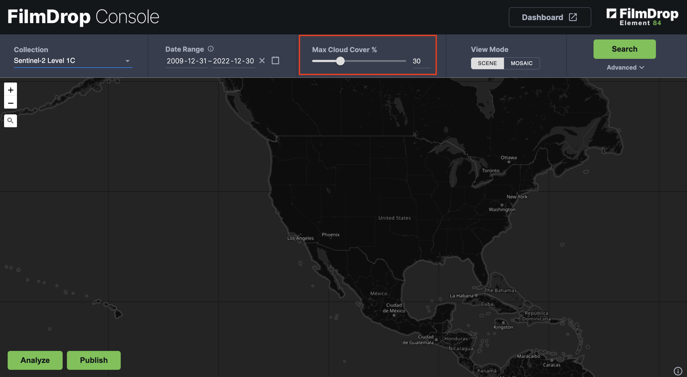

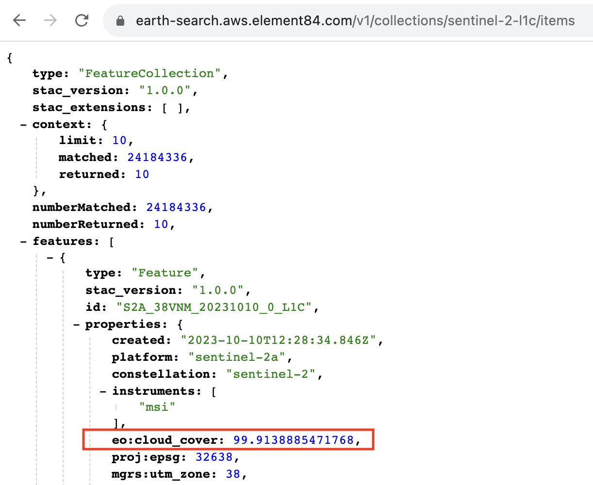

6. There are two modes of the UI. One is scene mode and the other is mosaic mode. Scene mode shows individual scenes of a STAC collection, whereas mosaic mode dynamically builds and renders a mosaic from Titiler's MosaicJSON endpoint and returns it back to the UI. Toggling between these two modes should show the Filmdrop brand logo in the center with the message "Loading FilmDrop UI" before loading the chosen mode (see the screenshot in (1)).

7. After a search result, a "soft" limit of 200 scenes is imposed and only those scenes are initially shown on the map (with a message such as, for example, *showing 200 of 502 scenes*); however, clicking “load all scenes” will run the same STAC search query again with a higher limit on the maximum number of scenes returned.

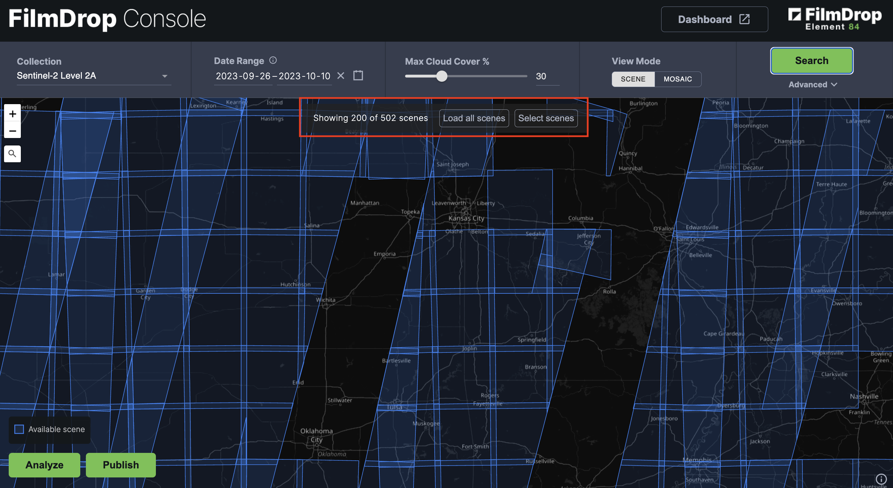

Only 200 out of 502 scenes are being displayed here due to the STAC search query getting automatically injected with a `limit` parameter with a value of 200. This is done to speed up the display and performance of the application.

8. After clicking on a scene's footprint, a loading spinner should display in the center. Then, a preview of that scene should display on the right popup if the corresponding STAC item for that scene has an asset with a role type of `thumbnail`.

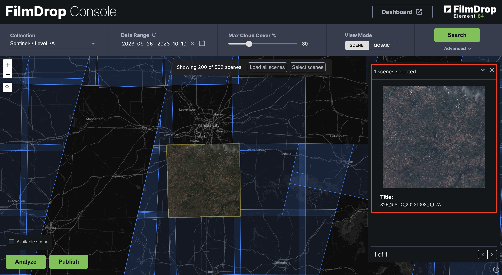

Looking at the matching STAC item record in EarthSearch shows that it contains a *thumbnail* asset:

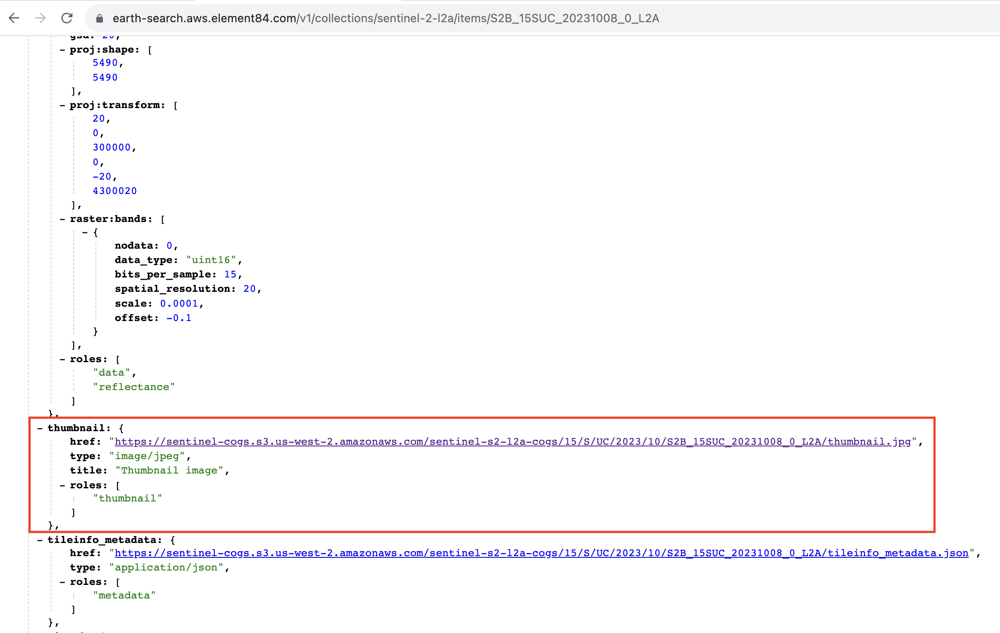

If the item does not contain an asset with role type *thumbnail*, there should not be a preview.

9. Clicking on a scene on the map after a search result will show a popup on the right with information scraped from the corresponding STAC item's metadata. The fields to display in the popup can be configured using the POPUP_DISPLAY_FIELDS variable in the config file. The fields should be displayed below the preview for that scene (if it exists). This can be seen in (8) above, where below the preview the title of the scene is shown. Title maps to the *id* property of a STAC item.
10. Typing either an address or a latitude,longitude coordinate in the geocoder on the left, will zoom to that location on the map and drop a pin.

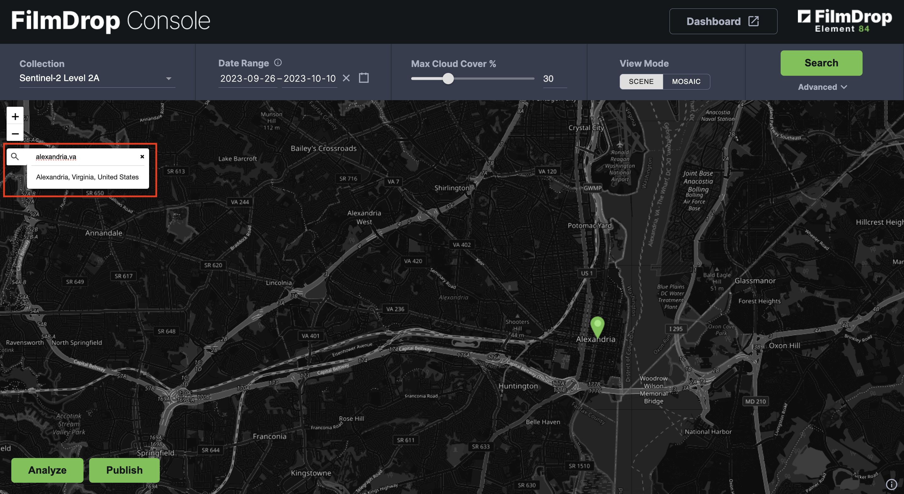

11. Some of the collections might support grid aggregations through the use of the STAC Aggregation Extension, which provides endpoints for acquiring aggregate information for matched scenes (i.e. items) in an area, such as total count and minimum/maximum datetimes. These aggregations, typically symbolized in the console UI using hexagons, are displayed at certain zoom levels, controlled by the SEARCH_MIN_ZOOM_LEVELS variable in the config file. For example, the *Copernicus-DEM GLO-90* collection within the [FilmDrop Demo Console UI](https://console.dev.demo.filmdrop.io/) uses hexagons to display the counts of scenes within each hexagon.

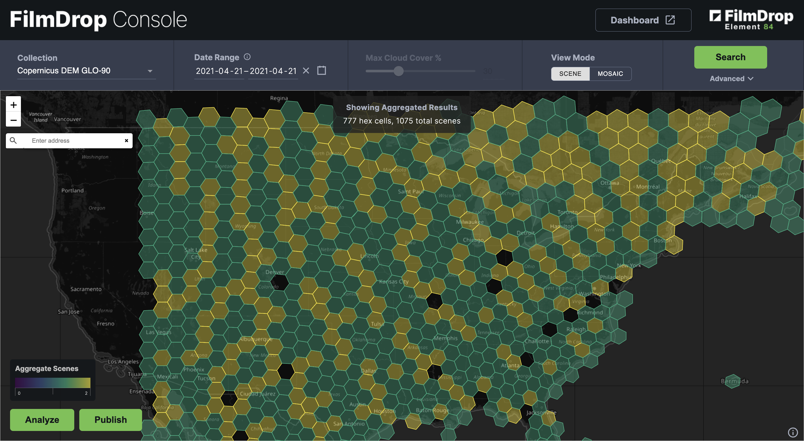

It would be important to check whether these aggregations are being displayed for only those collections that support the aggregations endpoints. For checking to see if a collection supports aggregations, you can check to see if any links with `rel` type of `aggregate/aggregations` are being defined on the collection.

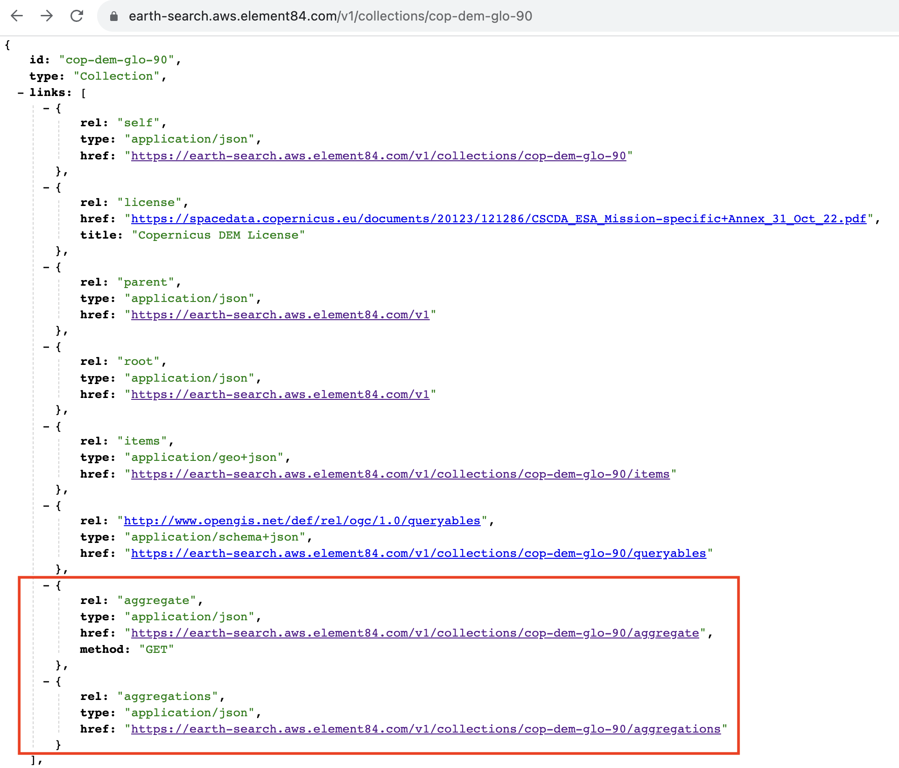

In summary, the key points to test on the application are:

* The application loads without any issues
* The map is where you want it to be - the initial extent and zoom level configuration is working properly
* The STAC collections are loaded into the drop-down list. The DEFAULT_COLLECTION variable in the config file is optional, so a default collection value is not required.
* Ensure that the date range aligns with the date range for the selected collection
* After a click event on a scene, make sure the preview shows if available
* Make sure configured metadata for a STAC item shows in the popup
* Make sure the scene is being rendered on the map
* You can verify that the date ranges, previews, metadata, cloud cover, etc for a scene are appropriate or fall within the correct range by checking the corresponding STAC item/collection's metadata by navigating to the *STAC_API_URL* endpoint
