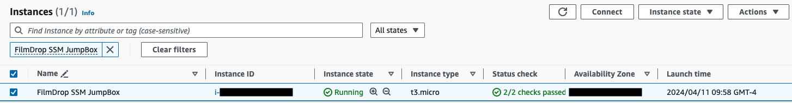
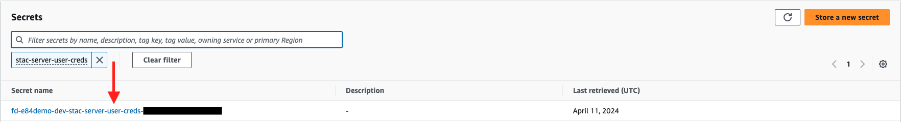

# Accessing resources running within VPC and the EKS cluster

The FilmDrop Environments will contain a private OpenSearch cluster as part of
the stac-server components which will be running on the Control Tower VPC. In
order to be able to access this private OpenSearch cluster, you will find a
FilmDrop SSM JumpBox ec2 instance which will be your entry point to your private
OpenSearch cluster.




## Uploading SSH Public Keys to FilmDrop SSH Public Keys bucket

**IMPORTANT!** Ensure it is your public key and **not** your private key -- you do
not want to share your private key with the world!

You will need to first upload your public key to the Public Keys bucket.

Log into the AWS Account that FilmDrop is deployed into.

Search for the S3 service, and make sure you're in your Account's VPC region,
   e.g., Oregon (us-west-2)


Locate the `fd-ssm-bastion-public-keys-*` S3 bucket


Upload your public key file


## Creating an SSH Tunnel through AWS SSM

Follow these steps to create the SSH Tunnel through the `FilmDrop SSM JumpBox`:

First, make sure you have the sessions-manager-plugin install by executing
`session-manager-plugin --version` in your terminal. If the command errors out,
please follow the [Install the Session Manager plugin for the AWS CLI](https://docs.aws.amazon.com/systems-manager/latest/userguide/session-manager-working-with-install-plugin.html)
instructions.

You will need to configure your ssh config file. In order to do so, start by
appending to your ~/.ssh/config file the following:

<!-- markdownlint-disable -->
```text
Host filmdrop-<REPLACE_WITH_PROJECT_NAME>-bastion
    User ec2-user
    ProxyCommand sh -c "aws ssm start-session --target `aws ec2 describe-instances --region <REPLACE_WITH_YOUR_ACCOUNT_REGION> --filters Name=tag:Name,Values="FilmDrop SSM JumpBox" Name=instance-state-name,Values=running | jq -r ".Reservations[].Instances[].InstanceId"` --document-name AWS-StartSSHSession --parameters 'portNumber=%p' --region <REPLACE_WITH_YOUR_ACCOUNT_REGION>"
    StrictHostKeyChecking=no

Host filmdrop--<REPLACE_WITH_PROJECT_NAME>-<REPLACE_WITH_PROJECT_ENVIRONMENT>-stac-open-search
    User ec2-user
    LocalForward 8443 <REPLACE_WITH_OPENSEARCH_DOMAIN_ENDPOINT>:443
    ProxyCommand sh -c "aws ssm start-session --target `aws ec2 describe-instances --region <REPLACE_WITH_YOUR_ACCOUNT_REGION> --filters Name=tag:Name,Values="FilmDrop SSM JumpBox" Name=instance-state-name,Values=running | jq -r ".Reservations[].Instances[].InstanceId"` --document-name AWS-StartSSHSession --parameters 'portNumber=%p' --region <REPLACE_WITH_YOUR_ACCOUNT_REGION>"
    StrictHostKeyChecking=no
```
<!-- markdownlint-enable -->

After you have the host entries in your ssh config file, you will need to
retrieve CLI AWS Keys for the AWS Account.


Copy the temporary CLI credentials to your terminal and connect directly to the
bastion host as:

```text
$ export AWS_ACCESS_KEY_ID=******************
export AWS_SECRET_ACCESS_KEY=******************
export AWS_SESSION_TOKEN=******************

$ ssh -i <PATH_TO_YOUR_PRIVATE_KEY> ec2-user@filmdrop-<REPLACE_WITH_PROJECT_NAME>-bastion
```

Alternatively, you can copy the temporary CLI credentials to your terminal and
start a tunnel through the bastion host to Open Search as:

```text
$ export AWS_ACCESS_KEY_ID=******************
export AWS_SECRET_ACCESS_KEY=******************
export AWS_SESSION_TOKEN=******************

$ ssh -i <PATH_TO_YOUR_PRIVATE_KEY> ec2-user@filmdrop--<REPLACE_WITH_PROJECT_NAME>-<REPLACE_WITH_PROJECT_ENVIRONMENT>-stac-open-search
```

After opening the tunnel, you should be able to access OpenSearch services by
going to <https://localhost:8443/_dashboards/app/login>


You can close your SSH Tunnel by executing CTRL+C or closing down your terminal
with the active connection.

## Retrieving OpenSearch Credentials

To retrieve the OpenSearch login credentials follow these steps.

Log into the Console for the AWS Account.

Search for the Secrets Manager service, and make sure you're in your Account's
VPC region, e.g.,Oregon (us-west-2):


Locate the `stac-server-user-creds` Secrets Manager secret:



Click on `Retrieve secret value` to obtain the OpenSearch credentials:


